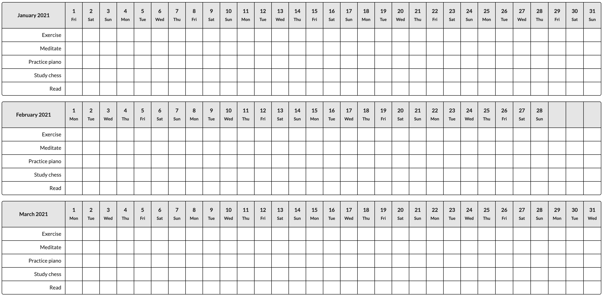

# Habit Tracker - Template Generator

A web app for generating printable (PDF) habit tracker templates. See live app for more details:

https://doggan.github.io/habit-template-gen/

## Development

- Install.

  - `npm install`

- Run the app in development mode.

  - `npm start`

- Build and deploy to GitHub Pages:

  - `npm run deploy`

## Known Issues / Potential Future Improvements

- Add drag/drop support to modify habit order.
- Improve PDF rendering (support multiple pages, fix aspect ratio bugs, etc).
  - TODO: maybe better to just render PDF directly into page to show final result; then download the PDF directly.
